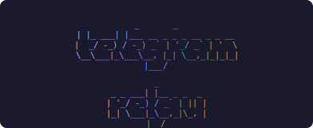
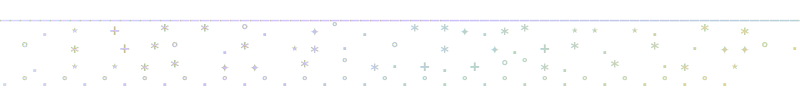
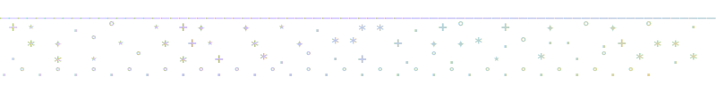
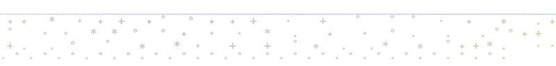
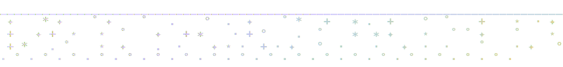
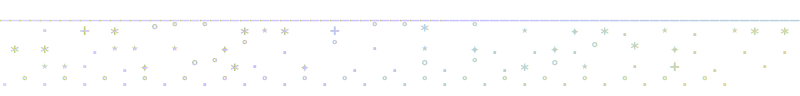
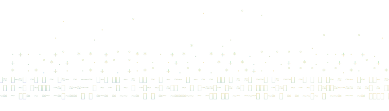

<p align="center">
  
</p>

<h1 align="center">telegram-relay</h1>

<p align="center">mirror telegram into discord, live — channels, groups, and DMs, as a real user over MTProto.</p>

<p align="center">
  
  
  
  
</p>

<p align="center">
  <a href="#what-it-does">what it does</a> · <a href="#how-fast">how fast</a> · <a href="#features">features</a> · <a href="#security">security</a> · <a href="#quickstart">quickstart</a> · <a href="#config">config</a> · <a href="#deploy">deploy</a>
</p>

<br>
<br>

<p align="center">
  
</p>

<br>
<br>

## what it does

logs in as a real telegram user over MTProto — the same protocol telegram desktop
speaks — so it sees what your own client sees: **channels, groups, and DMs**. it
mirrors the chats you pick into discord webhooks as branded, live-updating embeds.
single binary, local-first, no hosted anything.

a bot can't do this. telegram bots only see chats they've been added to and are
blind to channels and DMs. because this speaks MTProto as a user account, it can
watch any chat you can — the whole point of relaying a channel you read but your
discord friends don't.

built to forward a crypto channel into a friend's discord. runs unattended on a
box that's always on.

<br>
<br>

<p align="center">
  
</p>

<br>
<br>

## how fast

there's nothing to poll. MTProto holds a persistent connection and telegram
*pushes* new messages down it, so the relay reacts the instant a message is
published — not on an interval. end to end, telegram publish to discord accept, is
typically well under a second on a warm connection.

`telegram-relay stats` reports the real measured spread (p50/p95/max) from your own
traffic, computed from two independent authoritative clocks — telegram's publish
timestamp and discord's message snowflake — so it never depends on the relay host's
own clock.

<br>
<br>

<p align="center">
  
</p>

<br>
<br>

## features

| feature | what it does |
|---|---|
| live-updating embeds | each post becomes a discord embed with the source channel's name + photo as the webhook identity, a colored stripe, the original telegram timestamp, a link back to telegram, and a reaction/comment stats line. |
| state-aware colors | the stripe encodes state: regular posts are purple, an **edited** post turns orange, a **deleted** one turns red and says so. the color transitions in place as the source changes — read what happened without opening telegram. |
| reactions, edits, deletes | a background worker re-checks tracked posts and PATCHes the embed in place. reactions settle over the first hour; edits and deletes tracked for two days. |
| real media, inline | photos and videos relay as attachments *inside* the embed. multi-image albums coalesce into one gallery. link-only posts relay as text so discord renders its own preview. |
| fan-in / fan-out | one source can feed several channels; several sources can feed one. per-webhook dedup means adding a webhook to a route doesn't re-spam the others. |
| per-route identity | each route gets its own webhook avatar (the channel photo) and stripe color, so several sources funneled into one channel stay distinguishable. |
| catch-up + dedup | reconnects replay missed messages (telegram's native catch-up); a durable store guards against double-posting, even across restarts. |
| hot-reload | routes and filters re-read from `config.yaml` on a timer — add a channel without restarting. |
| backfill | `backfill <route> --count N` relays the last N posts of a channel on demand. |

<br>
<br>

<p align="center">
  
</p>

<br>
<br>

## security

logging in as your account means being careful with the reach that grants:

- **only the chats you configure are ever touched.** every incoming update is matched
  against your routes *before* any work happens — a message from any other chat your
  account is in is dropped immediately, before a byte of its media is fetched.
- **media never lands on disk.** attachments stream into memory, get posted, and are
  dropped — never decoded, parsed, or executed. per-route `mode: placeholder` relays a
  link instead and downloads nothing.
- **the session file is your account.** written owner-only (`chmod 600`), never
  committed, never leaves the machine. revoke any time from telegram → settings → devices.
- **webhook tokens never leak.** the types holding webhook urls won't print them; every
  error, log line, and ops notice is url-stripped first — enforced in the type system,
  not by convention.
- **hardened service** (`ProtectSystem=strict`, `PrivateTmp=true`, `NoNewPrivileges=true`)
  and **no phone-home** — messages go only to the webhooks you configure.

<br>
<br>

<p align="center">
  
</p>

<br>
<br>

## quickstart

1. get api credentials at [my.telegram.org](https://my.telegram.org) (api development
   tools → create an app) — an `api_id` and `api_hash`.
2. create `.env` next to the binary:
   ```
   TELEGRAM_API_ID=12345
   TELEGRAM_API_HASH=xxxxxxxxxxxxxxxxxxxxxxxxxxxxxxxx
   DISCORD_WEBHOOK_MAIN=https://discord.com/api/webhooks/…
   DISCORD_WEBHOOK_OPS=https://discord.com/api/webhooks/…   # optional
   ```
3. copy `config.example.yaml` to `config.yaml` and set your routes.
4. log in once (phone → code → optional 2FA): `telegram-relay login`
5. inspect and validate — none of these send anything:
   ```
   telegram-relay chats     # every dialog + its id
   telegram-relay routes    # ASCII wiring diagram (fan-in / fan-out)
   telegram-relay check     # validate webhooks + routes; exit 0/1
   ```
6. run it: `telegram-relay run`

**commands**

| command | purpose |
|---|---|
| `run` | run the relay (what the service invokes). |
| `login` | one-time interactive login; writes the session file. |
| `chats` | list every dialog with its numeric id. |
| `routes` | ASCII diagram of the routing (source → webhooks); no session needed. |
| `check` | validate config + webhooks (+ routes); exit 0/1. sends nothing. |
| `stats` | tracked-post counts and measured relay latency (p50/p95/max). |
| `backfill <route> [--count N]` | relay the last N posts of a route on demand. |

<br>
<br>

<p align="center">
  
</p>

<br>
<br>

## config

`config.yaml`:

| key | meaning |
|---|---|
| `routes[].name` | label for the route (used in logs). |
| `routes[].from` | source chat: `"@username"` or a numeric chat id. |
| `routes[].to` | webhook names (from `webhooks:`) to fan out to. |
| `routes[].color` | optional `"#RRGGBB"` stripe for regular posts; defaults `#9b7dff`. edited/deleted state colors override it. |
| `routes[].mode` | optional `reupload` / `placeholder`; overrides the global `media.mode`. |
| `routes[].filter` | optional `any_keywords` / `exclude_hashtags`. |
| `webhooks.<name>.env` | env var holding that webhook's url. |
| `ops_webhook.env` | optional webhook for error/failure notices only. |
| `media.mode` | `reupload` (download + inline) or `placeholder` (link only). |
| `media.max_bytes` | above this, fall back to a link instead of re-uploading. |
| `refresh.interval_mins` | edit/delete re-check cadence (default 30). |
| `refresh.horizon_hours` | stop tracking posts older than this (default 48). |
| `refresh.reaction_horizon_mins` | stop refreshing reactions after this (default 60). |
| `store.path` | sqlite file tracking relayed posts (default `relay.db`). |

all three routing shapes work with no code — they're just how you write `routes`:

```yaml
# one source -> one channel
- { name: solo, from: "@alpha", to: [chan_a] }
# many sources -> one channel (fan-in)
- { name: a, from: "@alpha", to: [firehose] }
- { name: b, from: "@beta",  to: [firehose] }
# one source -> many channels (fan-out)
- { name: split, from: "@alpha", to: [chan_a, chan_b] }
```

`telegram-relay routes` prints the resulting wiring and flags every fan-in and fan-out.

<br>
<br>

<p align="center">
  
</p>

<br>
<br>

## deploy

`deploy/` has a systemd unit, a failure-alert unit that posts to your ops webhook when
the relay goes down (`telegram-relay-alert@.service` + `relay-alert.sh`), and
`status.sh` for a health dashboard. build with `cargo build --release`, put `.env`,
`config.yaml`, and the session file next to the binary. `deploy/STATUS.md` documents
the boot chain.

silence means healthy — it posts only when a message is relayed, or when something is
actually wrong.

**non-goals:** not a full client (no sending from discord back into telegram), not
multi-account (one session per instance), not a hosted service (no dashboard, no cloud),
not a bot integration — MTProto as a user account, on purpose, to watch chats a bot
could never join.

<br>
<br>

<p align="center">
  
</p>

<br>
<br>

<p align="left"><strong>zayd / cold</strong></p>

<p align="center">
  <a href="https://zayd.wtf">zayd.wtf</a> · <a href="https://x.com/coldcooks">twitter</a> · <a href="https://github.com/zaydiscold">github</a>
  <br>
  <em>icarus only fell because he flew</em>
</p>

<p align="right">
  <strong>to do</strong><br>
  <sub>
  ☑ live relay — channels, groups, DMs over MTProto<br>
  ☑ real media inline in the embed (single + album gallery)<br>
  ☑ state colors — purple / orange edited / red deleted<br>
  ☑ live-updating reactions, comments, edits, deletes<br>
  ☑ fan-in / fan-out routing with per-webhook dedup<br>
  ☑ catch-up + durable cross-restart dedup<br>
  ☑ measured end-to-end latency (<code>stats</code>)<br>
  ☑ systemd deploy + failure watchdog<br>
  ☐ cold-reboot test of the boot chain<br>
  ☐ refresh CDN image urls past the 24h signature window<br>
  ☐ optional docker isolation for media<br>
  ☐ telegram → discord entity/markdown conversion
  </sub>
</p>

<p align="center"><sub>MIT — see <a href="LICENSE">LICENSE</a></sub></p>
